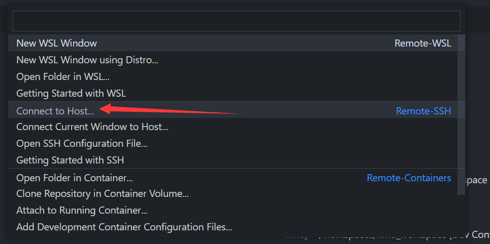
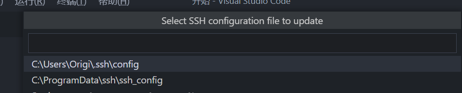
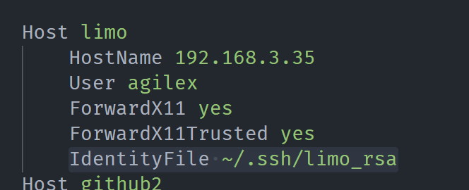

# 仓库使用说明

使用对应分支只需要：

```shell
$ git clone -b 分支名称 https://github.com/agilexrobotics/vscode_agilex_workspace.git
```

或

```shell
$ git clone https://github.com/agilexrobotics/vscode_agilex_workspace.git
$ git checkout 分支名称
```

- `limo-ros2`  ROS2 开发镜像，用于机器人机载电脑
- `limo-ros2-nvidia` Jetson 平台 ROS2 开发镜像，支持 CUDA 10.2 (Jetson Nano 已测试)
- `limo-ros1-nvidia` Jetson 官方平台 ROS1 开发镜像，仅支持 Jetson 平台
- `simulation-foxy` PC 端学习/仿真/开发镜像 只能用于 x86 架构
- `simulation-foxy-nvidia` PC 端学习/仿真/开发镜像 只能用于 x86 架构，适用于安装了 Nvidia 闭源驱动的电脑，提供 CUDA 支持

# 常见问题解决

参见 [常见问题解决](./常见问题解决.md)

# ROS 开发模板使用

本文主要讲解如何在 Jetson 平台上进行 ROS2 进行开发。

> 本文所述开发方式同样适用于任意开发平台，只是相对来讲要 Jetson 直接使用 ubuntu 20.04 或 ROS2 普通的方法相对困难

> 如果您想直接在 Jetson 设备或者工控机上进行在线开发，请直接转到 `配置远程开发环境` 章节，按照提示进行

鉴于 Jetson 官方暂无 `Ubuntu 20.04` 镜像，本文讲解如何使用 `Docker` + `VS Code` **快速部署** ROS2 开发环境

**Why Docker？**

- 相对于虚拟机 Docker 使用了 LXC 及 UnionFS 技术，极大的减轻了镜像体积和资源需求
- 启动迅速
- 基于 Docker File 文件构建镜像 或通过 Docker Hub 分享，可以让开发者快速部署**完全一样**的开发环境。
- Docker 开发者众多，**很多我们需要的开发环境早已有人分享**

**Why VS Code?**

诚然大家可能更加喜欢 `vim` `emacs` 等编辑软件。但经过笔者个人折腾，相对来讲 VS Code 的使用**门槛更低**，**插件丰富**且安装方便更有 **task 等高级功能**支持，可以更加简单的获得高效开发体验。

## 连接远程计算机

1. 首先确保我们本地电脑已经安装 VS Code 并且安装了如下插件：


成功安装后，在 VS Code 界面左下角会有如下图标：


确保 Jetson 和 本地电脑 处于**同一局域网**之中，找到 Jetson 的 ip 地址：


> 注意：推荐通过将 IP 地址与 MAC 地址绑定 或其他任何方式让 远程计算机 IP 地址不变。
>
> 如果 IP 在电脑重启后发生改变，则需要修改下文中的 `HostName` 字段的值

点击 左下角的小图标 ``

在弹出的对话框中选择 `Connect to Host`



选择 `configure SSH Hosts`


任选一个文件打开：



在打开的文件中追加如下内容

```
Host limo
    HostName 192.168.3.35
    User agilex
    ForwardX11 yes
    ForwardX11Trusted yes
```

> 参数含义：
>
> Host 别名，可以任起
>
> HostName 远程计算机 IP 地址
>
> User 登录使用的用户名
>
> ForwardX11 传递 X11
>
> ForwardX11Trusted 信任 X11

保存该文件即可，但此时我们登陆时仍需要输入密码，可以通过以下方法**免密登录**：

**免密登录配置（可选）**

首先生成密钥（Windows 用户通过 git bash 使用该指令）

```shell
$ cd ~/.ssh/
$ ssh-keygen
```

在提示信息中输入自定义密钥文件名称：


> 注意：如果此使用默认名称可能导致已存在密钥被覆盖！

之后一路点击回车，可以看到密钥生成成功：


接下来上传密钥文件到远程计算机：

```shell
$ ssh-copy-id -i limo_rsa.pub agilex@192.168.3.35
```

> limo_rsa.pub 为刚刚生成的公钥， agilex 为远程计算机用户名 192.168.3.35 为远程计算机地址

之后输入 远程计算机密码 即可成功上传公钥。


最后回到我们刚刚编辑的配置文件，在最后一行追加

```
IdentityFile ~/.ssh/limo_rsa
```

之后保存：



**建立连接**

点击 ``，在打开的选项中 选择 ``Connect to Host ``

在弹出的菜单中选择我们刚刚配置的选项：


在弹出的窗口中输入密码（已配置免密登录则不用）等待 VS Code 初始化远程环境，做下角图片变为如图所示内容表示连接成功：


## 配置远程开发环境

本节使用松灵 LIMO 机器人为例，搭载 Jetson Nano 主机。

在上节中打开的远程连接界面使用快捷键 ``Ctrl + ` ``（按键 “`” 在 ESC 键下方）打开命令行窗口


下载 limo-ros2-nvidia 开发模板到 Jetson （即 车载电脑）之上：

```shell
$ git clone -b limo-ros2-nvidia https://github.com/agilexrobotics/vscode_agilex_workspace.git
```

完成后点击 VSCode 菜单栏的 ``文件（File）---> 打开文件夹（Open folder)``（快捷键 ``Ctrl+K+O``）打开 ``vscode_agilex_workspace``


输入密码（配置免密登录后不需要）后 `Remote container` 插件会弹出提示：


点击 `Reopen in Container`

**如果没有弹出**则点击左下角 ``,在弹出的窗口中点击 `Remote container`


> 根据您的网络情况，第一次启动可能会花费十分钟左右进行下载，但**第二次开始即可一秒启动**
>
> 如果提示出现**错误**，一般是由于**网络原因**，请检查是否能正常访问 github 后重新尝试。

之后会 VSCode 会为我们自动配置开发环境。当文件管理器重新出现目录并且左下角图标变为：


即代表容器启动成功，现在的所有操作都在容器中进行，可以愉快的进行开发。

**下载 LIMO 软件包**

如果您在中国大陆，推荐首先运行 `switch_to_chinese_source.sh` 更换容器中镜像源，以避免网络原因导致的软件安装失败

```shell
$ chmod +x switch_to_chinese_source.sh
$ ./switch_to_chinese_source.sh
```

工作环境使用 VCSTOOL 工具自动化配置，只需要运行如下指令：

```shell
$ chmod +x setup.sh
$ ./setup.sh
```

即会下载 limo_ros2 包并自动运行 rosdep 安装依赖：

**编译**

可以直接运行 ``build.sh``：

```shell
$ chmod +x build.sh
$ ./build.sh
```

或使用 TASK 进行构建

## task 使用

workspace 默认配置了多个 VS Code Task 方便开发，

使用快捷键 ``Ctrl + shift + P`` 启动命令终端，输入 `run task`：


进入 Task 面板后输入 `build` 选择 `build`


即可看到程序自动构建软件包：


当然，除此之外 Task 中还包含了 代码格式化检查、创建功能包、更新工作空间、清理工作空间等任务，大家可以自行查看

## 一键 Debug

工作空间已经配置好了 Debug 环境，在 VS Code 左侧栏选择 Debug 选项即可

### **C++**


选择 GDB 调试 C++ 程序。之后点击绿色箭头开始 Debug：

这里以 `limo_base` 为例

分别输入 ``包名称``


和 ``程序名称``


之后 Task 会先编译程序（为了生成带 Debug 信息的程序），之后会自动打开调试页面：


之后即可按照正常形式开始调试！

### Python

## 访问图形界面

在 ROS2 开发过程中我们难免要使用  rviz2 等图形界面，经过笔者测试远程连接使用 X11 进行窗口绘制可能出现各种由 Nvidia 显卡导致的驱动问题导致无法成功绘制窗口，且即使成功绘制也会存在帧率过低的问题。

对此我们可以利用 ROS2 的分布式网络特性，**在本机主机接收远程电脑消息**并通过 rviz2 访问数据

当然，您也可以使用类似 VNC 软件远程访问。但根据笔者个人经验，其也可能出现由 Nvidia 驱动导致的各种问题，且帧率不高。

在我们本**地计算机**上（非 Jetson）下载开发模板

```shell
$ git clone -b simulation-foxy https://github.com/agilexrobotics/vscode_agilex_workspace.git
# 如果已经安装英伟达驱动和 nvidia-docker 使用下面的指令
# $ git clone -b simulation-foxy-nvidia https://github.com/agilexrobotics/vscode_agilex_workspace.git
```

按照前述方法，用 VSCode 打开 `vscode_agilex_workspace` 文件夹后 `Reopen in Container` 启动开发容器。

等待镜像下载完毕后使用快捷键 ``Ctrl + ` ``（按键 “`” 在 ESC 键下方）打开命令行窗口运行需要图形化的软件，比如 rviz2：

```shell
$ rviz2
```


如果需要接收远端数据，确保本机计算机和远程电脑处于同一局域网。并在远程电脑启动 ROS2 。

以 LIMO 为例，在**远程容器**中启动车辆底盘：

```shell
$ ros2 launch limo_bringup limo_start.launch.py
```

之后在本地 rviz2 中按照话题添加数据：


即可看到远程数据
